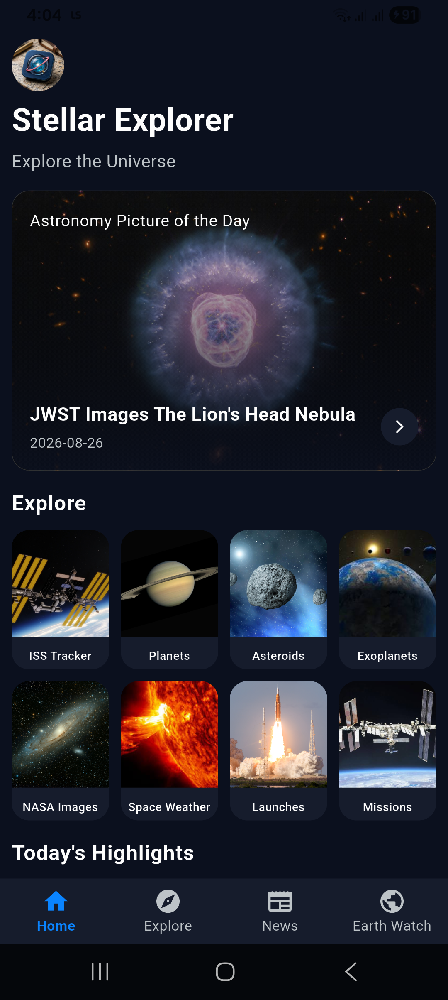
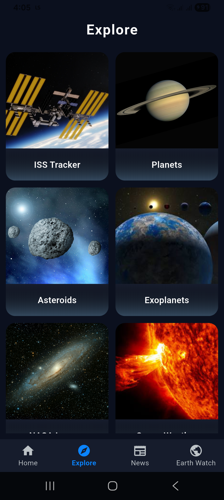
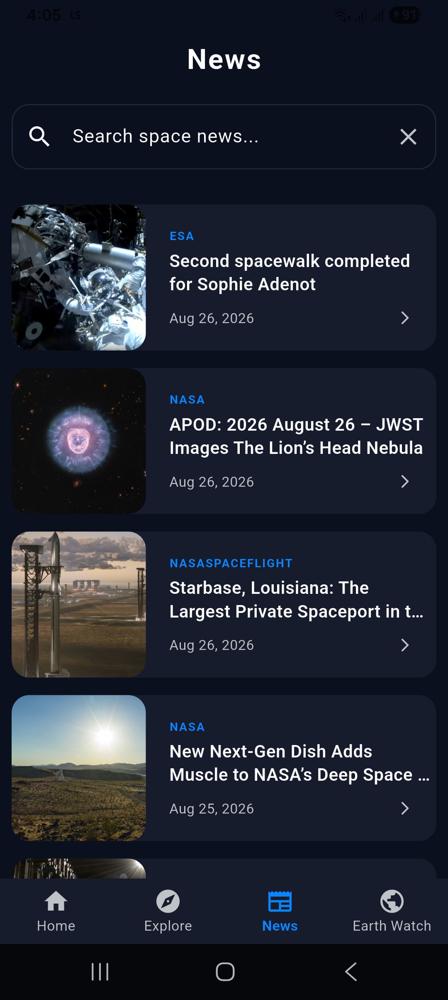

# 🚀 Stellar Explorer

A modern, premium **Space Exploration Companion** application built with **Flutter**, powered by **NASA Open APIs**, **The Solar System OpenData API**, and **Provider State Management**.

The application transforms your device into an interactive space command center, enabling users to explore real-time astronomical data, track the International Space Station, monitor near-Earth asteroids, read the latest space news, and discover thousands of cosmic images.

---

## ✨ Features

### 📸 Astronomy Picture of the Day (APOD)

* Daily High-Definition Space Images
* Detailed Image Descriptions
* Full-Screen Viewing

### 🛰️ ISS Live Tracker (Hero Feature)

* Real-time ISS Position Tracking
* Live Latitude, Longitude, and Altitude Metrics
* Current Velocity and Next Pass Information

### ☄️ Near-Earth Asteroids (NeoWs)

* Track Approaching Asteroids
* Hazard Status Indicators
* Distance, Speed, and Estimated Size Metrics

### 🌍 Earth Watch (EONET)

* Live Global Natural Events Monitoring
* Track Severe Storms, Wildfires, and Volcanoes
* Real-time NASA Earth Observatory Data

### 🌌 NASA Image Gallery & Space News

* Searchable Grid of Thousands of NASA Images
* Latest Articles via Spaceflight News API
* Historic and Active Space Missions Tracker

### 🪐 Planetary Data & Exoplanets

* Deep Physical Data of Solar System Planets and Moons
* Explore Newly Discovered Exoplanets

### 🎨 User Interface & Architecture

* Premium Dark Space Theme with Glassmorphism Cards
* Smooth Navigation & Pull-to-Refresh Functionality
* Clean Architecture (Presentation → Provider → Repository → API Services)

---

## 🛠️ Tech Stack

* Flutter
* Dart
* Provider (State Management)
* Dio (Robust REST API Networking)
* NASA Open APIs (APOD, NeoWs, DONKI, EONET)
* The Solar System OpenData API

---

## 📂 Project Structure

```text
lib/
│
├── models/
├── provider/
├── screens/
│   ├── dashboard_screens/
│   ├── detail_screens/
│   └── sub_screens/
├── services/
├── utils/
├── widgets/
└── main.dart
```

---

## 🚀 Implemented Features

* ✅ Splash & Onboarding Screens
* ✅ Home Dashboard with Quick Access Grid
* ✅ APOD Integration
* ✅ Live ISS Tracking Module
* ✅ Asteroid & Exoplanet Explorer
* ✅ Planets & Moons Detailed Data
* ✅ Earth Watch (EONET) Integration
* ✅ Space Weather (DONKI) Reports
* ✅ Searchable NASA Image Gallery
* ✅ Upcoming Launches & Historic Missions
* ✅ Space News Feed
* ✅ Favorites System
* ✅ Provider State Management
* ✅ Custom Dark Theme UI

---

## 📱 Application Screens

<p align="center">
  
  
  
  
</p>

---

## 🔑 API Configuration

This project relies on multiple public APIs. You need to configure your own API keys for the app to function correctly.

Create the following file:

```text
lib/services/api_constants.dart
```

Add your keys in the following format:

```dart
class ApiConstants {
  static const String baseUrl = "https://api.nasa.gov";

  static const String apiKey = "YOUR_NASA_API_KEY_HERE";

  static const String baseUrlForPlanetsData =
      "https://api.le-systeme-solaire.net/rest/";

  static const String apiKeyForPlanetsData = "YOUR_UUID_KEY_HERE";
}
```

Get your free API keys:

**NASA API Key:**
https://api.nasa.gov

**Solar System OpenData API Token:**
https://api.le-systeme-solaire.net/generatekey.html

> **Note:** The ISS Tracker, Earth Watch, NASA Image Library, and Launch Library 2 (Dev) APIs do not require API keys and will work out of the box.

---

## 👨‍💻 Author

**Saqib**

Flutter Developer

---

## 📄 License

This project is created for learning, educational, and portfolio purposes.
